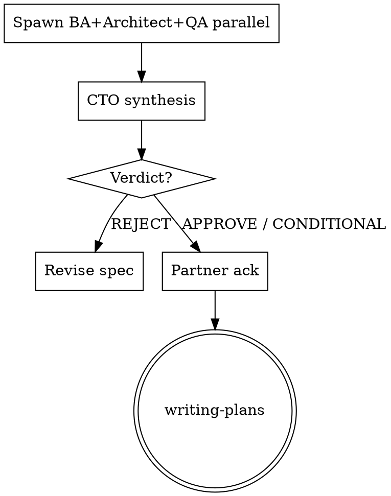

# Spec Review (CTO Gate)

You are the **CTO orchestrator**. Three independent critical reviewers, then one CTO synthesis. Solo hats and rubber stamps are not a review.

**Violating the letter of the rules is violating the spirit of the rules.**

**REQUIRED BACKGROUND:** Spec comes from superpowers:brainstorming. After a clean CTO verdict (or partner waiver of named CONDITIONAL items), next skill is superpowers:writing-plans.

## Iron Law

```
NO WRITING-PLANS OR IMPLEMENTATION UNTIL CTO VERDICT IS RECORDED
```

Partner "skip" does **not** cancel the gate. They may waive named CONDITIONAL items **after** seeing findings — not before.

**No exceptions:**
- Don't solo-review as "CTO" / one agent with three hats
- Don't APPROVE because the doc's own B1–Bn table looks complete
- Don't invent CTO conclusions while writing reviewer findings
- Don't proceed to writing-plans on an unrecorded gate

## Process

1. **Announce:** "Using spec-review to run BA / Architect / QA under CTO synthesis."
2. **Load** the named `*-design.md` plus related/superseded paths for reviewers.
3. **Spawn three parallel subagents** (one turn) with templates:
   - [reviewers/business-analyst.md](reviewers/business-analyst.md)
   - [reviewers/system-architect.md](reviewers/system-architect.md)
   - [reviewers/senior-qa.md](reviewers/senior-qa.md)
4. **CTO synthesis (you)** only after all three return — required shape below.
5. **Present verdict to partner and stop.** Wait before writing-plans or spec edits.

**Hard requirements:** fresh subagents; absolute paths; graphify-first when `graphify-out/graph.json` exists (put that rule in every reviewer prompt); reviewers read-only.



## CTO verdict shape (required order)

```markdown
## CTO verdict
**Decision:** APPROVE | CONDITIONAL GO | REJECT
**Spec:** <path>

### Executive summary
<2–4 sentences: strongest risk + why this decision>

### Blockers (must resolve before writing-plans)
- [B#] <finding> — source: BA|Architect|QA — <why>

### Should-fix (CONDITIONAL must be non-empty here)
- [S#] ...

### Nits
- [N#] ...

### Cross-persona conflicts
- <conflict>: resolution = <choice + reason>  (or None)

### Persona roll-up
- BA: <1-line> | Architect: <1-line> | QA: <1-line>

### Next step
REJECT → revise spec, re-run spec-review
CONDITIONAL GO → partner waives/fixes Should-fix, then writing-plans
APPROVE → partner ack, then writing-plans
```

**Calibration:** Weight severity, not headcount. APPROVE only with zero blockers and no unresolved money/identity/migration conflicts. Prefer CONDITIONAL GO over fake "APPROVED WITH NITS."

## Rationalizations

| Excuse | Reality |
| --- | --- |
| "Partner said skip" | Run gate; waive named items after findings. |
| "Doc already addressed B1–Bn" | Tables are claims — verify against code. |
| "3 agents overkill / one agent three hats" | Shared blind spots; parallel independents mandatory. |
| "Inline BA/Architect/QA sections = multi-persona" | Writing three headings yourself is still one mind. Spawn. |
| "Quick CTO skim" / "answer this turn" | Latency ≠ waiver. Architect+QA must investigate codebase. |
| "I'm tired; one synthesis beats three thin reports" | Exhaustion favors shortcuts; gate still runs. |
| "Read-only reviewers can't improve the spec" | Findings are the product; edits come after REJECT/CONDITIONAL. |
| "Gaps belong in writing-plans" | Plans encode wrong assumptions. |
| "Prior REJECT cycle = done" | Revised specs need delta re-check. |
| "Narrow prompts / shorter reviews = collapse OK" | Narrow focus is fine; collapsing personas into one agent is not. |
| "Partner waived the gate in advance" | Only named Should-fix after a recorded CONDITIONAL verdict. |

## Red Flags — discard shortcut, re-run gate

Jumping to writing-plans · solo/four-hat review · mega-prompt or inline "persona sections" without subagents · markdown-only Architect/QA · verdict before three reports · APPROVE from blocker tables alone · empty findings + praise · "efficiency" / latency / exhaustion as reason to skip parallel spawn

## Common Mistakes

Reviewers editing the spec → read-only. CTO pasting all three reports → dedupe into B/S/N. Serial dispatch → parallel. Omitting related specs → pass links. Running reviewers then also writing-plans in the same turn → stop after verdict.
